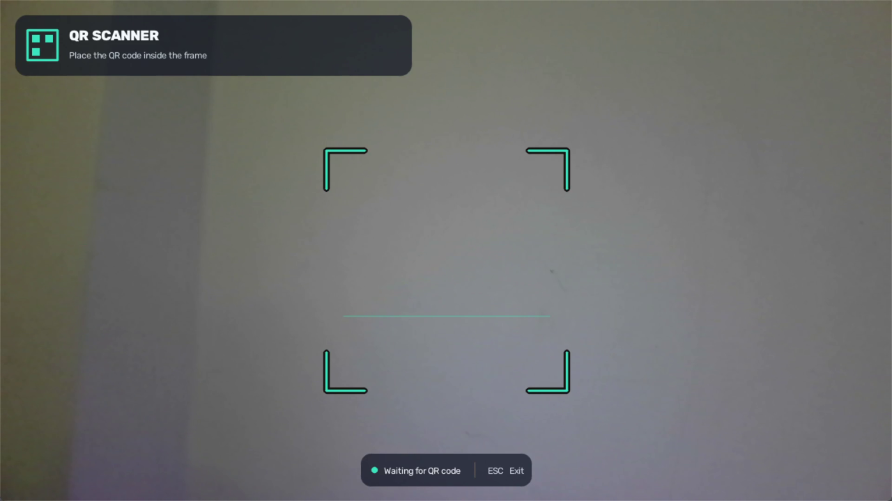

# Webcam QR Scanner

[English](README.md) | **Türkçe**

Bilgisayar kamerasından veya doğrudan ekrandan QR kod okuyan hızlı ve güvenli
bir Windows masaüstü uygulaması.



## Kullanım videosu

Tanıtımda bu public GitHub reposunun adresini içeren QR kod okunur, bağlantı
varsayılan tarayıcıda açılır ve QR Scanner otomatik olarak kapanır.


> **Geliştirme durumu:** Güncel kararlı GitHub sürümü `v0.1.1`'dir. Mevcut
> kaynak kod aşağıda anlatılan `v0.2.0-dev` masaüstü yaşam döngüsü altyapısını
> ve yalnızca localhost'ta çalışan yalıtılmış Telefon-PC taşıma prototipini de
> içerir. Kısa ömürlü, tek kullanımlık şifreli eşleştirme akışı artık yerel
> relay üzerinden çalışır. Kullanıcıya gösterilecek eşleştirme QR'ı, tepsi
> entegrasyonu, internet relay'i ve mobil PWA henüz çalışır durumda değildir
> ve yayıma hazır özellikler gibi sunulmaz.

## Özellikler

- Modern turkuaz arayüzle canlı kamera görüntüsü
- Aynı zamanda gerçek QR analiz alanı olan görünür tarama çerçevesi
- Tüm bağlı ekranları tek sefer tarayan ayrı `Scan Screen` seçeneği
- Ekran taramalarında hedef alan adını gösteren bağlantı onayı
- Farklı QR kodlar bulunduğunda güvenli tıkla-seç ekranı
- Tek veya birden fazla QR kod algılama
- Geçerli HTTP/HTTPS bağlantılarını otomatik açma
- İlk başarılı okumadan sonra kamera penceresini otomatik kapatma
- Aynı QR kodun tekrar tekrar açılmasını engelleme
- 1920×1080, 30 FPS hedefi ve otomatik 1280×720 geri dönüşü
- Yalnızca en güncel kareyi işleyen, görüntüyü dondurmayan arka plan analizi
- Küçük veya uzaktaki QR kodlar için belirli aralıklarla kapsamlı tarama
- Telefon ekranında gösterilen QR kodlar için ek görüntü işleme
- `--show-fps` ile isteğe bağlı geliştirici FPS göstergesi
- `Esc` veya pencerenin kapatma düğmesiyle yalnızca kamerayı kapatma
- Sistem tepsisinden kamera ve ekran işlemleri sunan arka plan denetleyicisi
- `Ctrl+Q` veya tepsideki **Exit QR Scanner** ile onaylı tam çıkış
- Terminal göstermeyen bağımsız Windows EXE paketi

## İndirme ve kullanım

Son GitHub Release içinden `Webcam-QR-Scanner-v0.1.1-windows-x64.zip` dosyasını
indirin ve arşivden çıkarın. Python veya OpenCV'yi ayrıca kurmanız gerekmez.

### Kamerayla tarama

`QR-Scanner.exe` dosyasına çift tıklayın:

1. Windows kamera izni isterse izin verin.
2. QR kodun tamamını turkuaz çerçevenin içine yerleştirin.
3. Geçerli web bağlantısı varsayılan tarayıcıda açılır.
4. Kararlı `v0.1.1` sürümünde ilk başarılı okumadan sonra QR Scanner kapanır.

### Bilgisayar ekranında görünen QR kodu tarama

Ekranda yalnızca bir QR kodu açık bırakın ve `Scan Screen.vbs` dosyasına çift
tıklayın.

> **Önemli:** `Scan Screen.vbs` çalıştırıldığı anda QR kod ekranda tamamen görünür
> olmalıdır. Başka bir pencerenin arkasında kalan, küçültülmüş veya etkin olmayan
> bir tarayıcı sekmesindeki QR kod okunamaz. Uygulama arka plandaki pencere
> içeriğini değil, ekranda o anda görünen görüntüyü tarar.

1. Uygulama bağlı ekranların tamamını bir kez yakalar.
2. Görüntü yalnızca bellekte tutulur ve hiçbir zaman kaydedilmez.
3. QR geçerli bir HTTP/HTTPS bağlantısı içeriyorsa onay penceresinde hedef alan
   adı ve tam adres gösterilir.
4. Açmak için **Yes**, vazgeçmek için **No** seçin.

Aynı anda farklı QR kodlar algılanırsa hiçbir bağlantı açılmaz. Diğerlerini
gizleyip `Scan Screen.vbs` dosyasını yeniden çalıştırın. Ekran sürekli izlenmez.

Tek dosyalı paket, içindeki dosyaları hazırladığı için ilk açılış birkaç saniye
daha uzun sürebilir. İnternetten indirilen imzasız EXE'ler için Windows
SmartScreen uyarı gösterebilir.

### Güncel geliştirme paketi: arka plan davranışı

Mevcut kaynak kod ve yerel olarak oluşturulan `v0.2.0-dev` paketi yine tek bir
`QR-Scanner.exe` dağıtır; EXE kendi içinde ayrı çalışma kipleri başlatır:

- Hafif masaüstü denetleyicisi Windows sistem tepsisinde görünür kalır.
- Kamera yalnızca kullanıcı istediğinde, ayrı bir süreçte açılır.
- `Esc`, kamera penceresinin kapatma düğmesi veya başarılı okuma yalnızca
  kamerayı kapatır. Denetleyici kamerayı kullanmadan tepside kalır.
- Kamera ilk kez kapandığında uygulamanın tepside kaldığını anlatan tek seferlik
  bildirim gösterilir.
- Tepsi menüsünde **Scan with Camera**, **Scan Screen**, **Start with Windows**
  ve **Exit QR Scanner** seçenekleri bulunur.
- EXE yeniden açılırsa ikinci bir denetleyici veya ikinci kamera oluşturmak
  yerine mevcut tepsi örneğinden kamera açılması istenir.
- Kameradayken `Ctrl+Q` veya tepsideki **Exit QR Scanner**, her şeyi durdurmadan
  önce onay ister.
- **Start with Windows** varsayılan kapalıdır; açılırsa Windows oturumunda
  yalnızca denetleyiciyi başlatır, kamerayı açmaz.

Denetleyici şu anda relay'e bağlanmaz ve ağ trafiği göndermez. **Pair Phone**
seçeneği tepside açıkça gelecek `v0.2` özelliği olarak işaretlidir.

**Scan Screen** farklı QR kodlar bulursa geliştirme sürümü, algılanan kodları
çerçeveleyen ve yalnızca bellekte tutulan donmuş ekran görüntüsünü gösterir.
Fare hareketi en yakın kodu vurgular; yalnızca QR sınırına doğrudan tıklamak
seçim yapar. `Esc` iptal eder ve seçilen URL açılmadan önce mevcut alan adı
onayı yine gösterilir.

## Telefon ekranından daha iyi tarama

- Ekran parlaklığını en yüksek seviyede kullanmayın. Yansıma ve aşırı pozlama QR
  kodun algılanmasını zorlaştırabilir.
- Orta seviye parlaklık genellikle daha iyi sonuç verir.
- Telefonu mümkün olduğunca düz tutun; yansımayı azaltmak için açısını hafifçe
  değiştirin.
- QR kodun tamamını çerçeveye alın ve yaklaşık 15–30 cm mesafeden başlayın.
- Dalgalı moiré deseni oluşursa telefonu birkaç santimetre ileri veya geri alın.

## Performans

Kamera yakalama ve QR çözümleme birbirinden bağımsız çalışır. Arka plan işçisi
kuyruk oluşturmak yerine yalnızca en güncel kareyi analiz eder; böylece QR
işleme kamera görüntüsünü dondurmaz. Analiz yalnızca turkuaz çerçevenin içinde
yapılır.

Uygulama başlangıçta 1920×1080, 30 FPS kamera akışını ölçer. Kamera bu
çözünürlüğü desteklemiyorsa veya ölçülen hız 24 FPS'nin altında kalıyorsa
1280×720, 30 FPS ayarına geçmeyi dener.

### Yerel benchmark

Bu değerler geliştirme bilgisayarında ölçülmüştür ve performans garantisi
değildir. Kamera, işlemci, Windows sürücüsü ve ortam ışığı sonucu etkileyebilir.

- Platform: Windows, OpenCV Media Foundation kamera arka ucu
- Kamera hedefi: 1920×1080, 30 FPS
- Kapsam: kamera yakalama, arka plan QR analizi ve arayüz çizimi
- Ölçülen tam işlem hattı: yaklaşık 30,1 FPS
- Ölçülen hızlı QR analiz kapasitesi: yaklaşık 48,7 FPS

FPS sayacı varsayılan olarak gizlidir. Geliştirici ölçümü için:

```powershell
.\.venv\Scripts\python.exe launcher.py --show-fps
```

Normal performans turkuaz, 24 FPS altındaki değerler amber renkte gösterilir.
Yeşil yalnızca başarılı QR okumasını belirtir.

## Kaynak koddan çalıştırma

Python 3.10 veya daha yeni bir sürüm gerekir:

```powershell
py -m venv .venv
.\.venv\Scripts\python.exe -m pip install -r requirements.txt
.\.venv\Scripts\python.exe launcher.py
```

Kullanışlı seçenekler:

```powershell
# Farklı kamera kullan
.\.venv\Scripts\python.exe launcher.py --camera 1

# Bağlantıları otomatik açma
.\.venv\Scripts\python.exe launcher.py --no-open

# İlk QR koddan sonra açık kal
.\.venv\Scripts\python.exe launcher.py --keep-open

# Geliştirici FPS göstergesini aç
.\.venv\Scripts\python.exe launcher.py --show-fps

# Bağlı ekranların tamamını bir kez tara
.\.venv\Scripts\python.exe launcher.py --screen
```

`QR Scanner.vbs` kaynak sürümü terminal göstermeden başlatır.
`Scan Screen.vbs` ayrı, tek seferlik ekran taramasını terminal göstermeden
başlatır. `start_qr_scanner.bat` ise sorun giderme günlükleri için terminali
açık tutar.

## Yerel Telefon-PC geliştirici demosu

Bu yalnızca geliştirme amaçlı demo, mobil PWA veya açık internet relay'i
eklenmeden önce ilk şifreli taşıma dilimini doğrular:

```powershell
.\.venv\Scripts\python.exe -m pip install -r requirements-dev.txt
.\.venv\Scripts\python.exe -m bridge.local_demo
```

Komut yalnızca `127.0.0.1` adresine bağlanan bir relay başlatır; iki dakikalık,
tek kullanımlık şifreli eşleştirme akışını tamamlar, P-256 ECDH ve HKDF ile
telefon ve PC için aynı kök anahtarı türetir, örnek URL'yi AES-256-GCM ile
şifreler, okunamayan URL zarfını HTTP/WebSocket üzerinden iletir ve PC'de açma
onayı ister. **No** hiçbir şey açmaz; **Yes** örnek adresi açar. Kimlik bilgileri
yalnızca bellekte yaşar. Relay URL veya URL mesaj geçmişi tutmaz; okunamayan
pairing zarflarını yalnızca kısa oturum sona erene kadar bellekte tutar.

Test adresini belirlemek için `--url https://example.com`, pencere açmadan tam
otomatik doğrulama için `--no-dialog` kullanılabilir. Bu demo tamamen aynı
bilgisayarda çalışır; mobil özellik değildir ve yerel ağa veya internete
açılmaz.

## Testler

```powershell
.\.venv\Scripts\python.exe -m unittest discover -s tests -v
.\.venv\Scripts\python.exe launcher.py --self-test
```

Self-test, kamera açmadan OpenCV yüklemesini ve QR çözümlemeyi doğrular.

## Windows EXE oluşturma

```powershell
.\.venv\Scripts\python.exe -m pip install -r requirements-dev.txt
.\build_exe.bat
```

Build sonunda terminal göstermeyen EXE ile dağıtıma hazır arşiv oluşturulur:

```text
dist\Webcam-QR-Scanner-v0.2.0-dev-windows-x64.zip
```

ZIP içinde `QR-Scanner.exe`, `Scan Screen.vbs` başlatıcısı, proje MIT lisansı,
üçüncü taraf bildirimi ve pakete dahil bağımlılıkların eksiksiz lisans metinleri
bulunur. Bütünlük kontrolü için ayrıca `SHA256SUMS.txt` üretilir.

## Proje yapısı

- `app.py`: uygulama akışı ve komut satırı seçenekleri
- `launcher.py`: hafif kip seçimi ve tek denetleyici başlangıcı
- `tray_app.py`: sistem tepsisi işlemleri ve alt süreç yaşam döngüsü
- `app_settings.py`: atomik, kullanıcıya özel arayüz tercihleri
- `bridge_signals.py`: EXE kipleri arasındaki yerel kontrol sinyalleri
- `windows_startup.py`: isteğe bağlı kullanıcı bazlı Windows başlangıç kaydı
- `camera.py`: kamera seçimi, Full HD ölçümü ve 720p geri dönüşü
- `qr_reader.py`: hızlı ve kapsamlı QR çözümleme
- `screen_capture.py`: tek seferlik, çoklu monitör Windows ekran yakalama
- `screen_selector.py`: çoklu ekran QR'ları için güvenli tıkla-seç görünümü
- `scan_worker.py`: yalnızca en güncel kareyi işleyen arka plan işçisi
- `scan_geometry.py`: gerçek tarama alanı ve koordinat dönüşümleri
- `ui.py`: arayüz, hareketli tarama çizgisi ve sonuç görünümü
- `links.py`: güvenli URL sınıflandırma ve tarayıcı açma
- `performance.py`: isteğe bağlı FPS ölçümü
- `protocol/`: `wqrs/1` şemaları, test vektörleri ve bağımsız doğrulama araçları
- `bridge/`: şifreli eşleştirme/mesaj çekirdeği, PC alıcısı, sahte telefon ve yerel demo
- `relay/`: bellekiçi, yalnızca localhost'ta çalışan FastAPI relay'i
- `tests/`: otomatik davranış, kamera seçimi ve QR okuyucu testleri

## Güvenlik

Yalnızca açıkça yazılmış, geçerli `http://` ve `https://` bağlantıları otomatik
açılır. `javascript:` veya `file:` gibi şemalar çalıştırılmaz. QR kod kamerada
tutulduğunda sürekli yeni tarayıcı sekmeleri açılmaz.

Kamera kareleri yalnızca bilgisayar belleğinde yerel olarak işlenir; kaydedilmez
ve bilgisayar dışına gönderilmez. Uygulama konum bilgisi istemez; analiz,
telemetri veya cihaz kimliği toplamaz. Geçerli bir URL açıldıktan sonra hedef
site varsayılan tarayıcı tarafından işlenir ve tarayıcının gizlilik ayarlarına
tabidir.

Ekran taraması kullanıcı tarafından açıkça başlatılır ve sanal masaüstünü
yalnızca bir kez yakalar. Yakalanan pikseller yerel olarak bellekte işlenir,
diske yazılmaz. Ekrandaki bir QR bağlantısı onay alınmadan açılmaz. Farklı
içerikler algılanırsa uygulama otomatik karar vermek yerine kullanıcının görünür
QR sınırına tıklamasını ister. Fare yakınlığı yalnızca vurguyu değiştirir ve
bağlantı açamaz.

Geliştirme sürümündeki sistem tepsisi denetleyicisi kamerayı arka planda
etkinleştirmez ve relay'e bağlanmaz. **Start with Windows** yalnızca bu
uygulamanın mevcut kullanıcıya ait başlangıç kaydını yazar ve ancak kullanıcı
menü seçeneğini değiştirdiğinde işlem yapar. Ayrı geliştirici relay'i yalnızca
açık demo komutu çalışırken `127.0.0.1` adresine bağlanır; token'ların HMAC
özetleriyle yönlendirme kimliklerini tutar, URL veya mesaj geçmişi tutmaz.
Gelecekteki üretim Telefon-PC ağ bağlantısı kullanıcı eşleştirmeyi açıkça
başlatana kadar kapalı kalacaktır.

Uygulama URL şemasını doğrular ancak bir sitenin güvenilir veya zararlı olduğunu
belirleyemez. Ekrandaki QR bağlantısını açmadan önce onay penceresinde gösterilen
alan adını kontrol edin.

## Yol haritası

### v0.1 — Windows masaüstü sürümü

- [x] Kaynak kodu GitHub reposunda yayımlama
- [x] Terminal göstermeyen bağımsız Windows EXE paketi
- [x] GitHub Releases üzerinden `v0.1.0` yayımlama
- [x] Ekran görüntüsü, kullanım GIF'i ve sürüm notları

### v0.1.1 — Bilgisayar ekranındaki QR kodları okuma

- [x] Ayrı `Scan Screen` başlatıcısı ekleme
- [x] Bağlı ekranların tamamını görüntü kaydetmeden bir kez yakalama
- [x] Ekran URL'sini açmadan önce alan adını gösterme ve onay isteme
- [x] Farklı QR içerikleri bulunan belirsiz taramaları engelleme
- [x] Otomatik testleri ve bağımsız Windows paketini hazırlama

### v0.2 — Kurulum gerektirmeyen PWA ile Telefon-PC köprüsü

Kısa süre geçerli QR kod ve bilgisayarda tek seferlik onay ile hesapsız
eşleştirme planlanıyor. Kullanıcı telefona native uygulama kurmadan HTTPS
üzerinden mobil PWA'yı açabilecek; isterse ana ekranına ekleyebilecek. PWA QR'ı
cihazda çözüp **Open on this phone** ve **Send to PC** seçeneklerini gösterecek.
URL tarayıcının yerleşik WebCrypto API'siyle uçtan uca şifrelenecek ve içeriği
okuyamayan internet relay'i üzerinden iletilecek. Yerel ağ veya konum izni
gerekmeyecek. Bilgisayar içeriği doğrulayacak ve varsayılan olarak açmadan önce
kullanıcıdan onay isteyecek.

Ayrıntılı mimari, eşleştirme protokolü, tehdit modeli ve kabul ölçütleri:
[v0.2 teknik tasarım belgesi](docs/phone-to-pc-technical-design.tr.md).

- [x] PWA uyumlu `wqrs/1` JSON şemaları ve tehdit modeli kontrol listesi
- [x] P-256/HKDF/AES-GCM vektörlerini doğrulayan Python, bağımsız Node.js ve
  tarayıcı uyumlu WebCrypto kodu
- [x] Ayrı kamera ve ekran süreçlerine sahip tek EXE masaüstü denetleyicisi
- [x] Sistem tepsisi, tek seferlik kamera-kapandı bildirimi, isteğe bağlı
  Windows başlangıcı ve onaylı tam çıkış
- [x] Yalnızca arka plan denetleyicisi çalışırken kameranın kapalı kalması
- [x] Çoklu ekran QR'ları için açık tıkla-seç görünümü
- [x] Localhost relay ve sahte telefonla ilk şifreli uçtan uca aktarım
- [x] İki dakikalık, tek kullanımlık ve şifreli onay/ret içeren pairing HTTP akışı
- [ ] Eşleştirme QR'ını ve onay penceresini tepsi denetleyicisinden gösterme
- [ ] Kalıcı PC alıcısını tepsi denetleyicisine bağlama
- [ ] PWA, Browser WebCrypto, kamera ve gerçek Android/iOS tarayıcı testleri

### v0.2.1 — Şifreli kuyruk ve hatırlatmalar

Bilgisayar çevrimdışıysa şifreli öğe bilgisayar yeniden bağlanana kadar PWA'nın
yerel deposunda tutulabilecek. Tarayıcılar arka plan çalışmasını garanti
etmediğinden hatırlatma ve zamanlayıcı desteği yalnızca gerçekten desteklenen
cihazlarda sunulacak; otomatik açma açık bir kullanıcı tercihi olarak kalacak.

### v0.2.2 — İsteğe bağlı yerel ağ modu

İki cihaz aynı ağdayken internet aracısı kullanmak istemeyen kullanıcılar için
doğrudan yerel ağ aktarımı daha sonra isteğe bağlı alternatif olarak
eklenebilir.

## Lisans

Telif hakkı © 2026 [alpkonakci](https://github.com/alpkonakci).

Bu proje [MIT Lisansı](LICENSE) ile lisanslanmıştır.
Paketlenen bağımlılıkların lisansları
[THIRD_PARTY_NOTICES.md](THIRD_PARTY_NOTICES.md) dosyasında açıklanmıştır.
