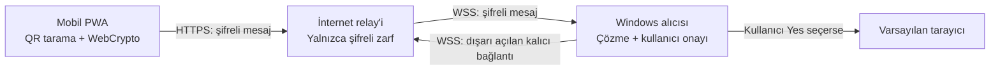
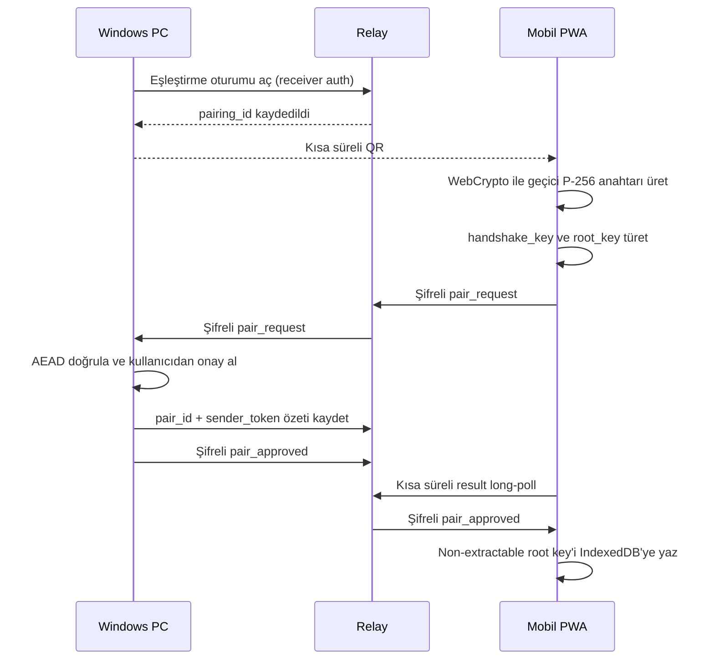
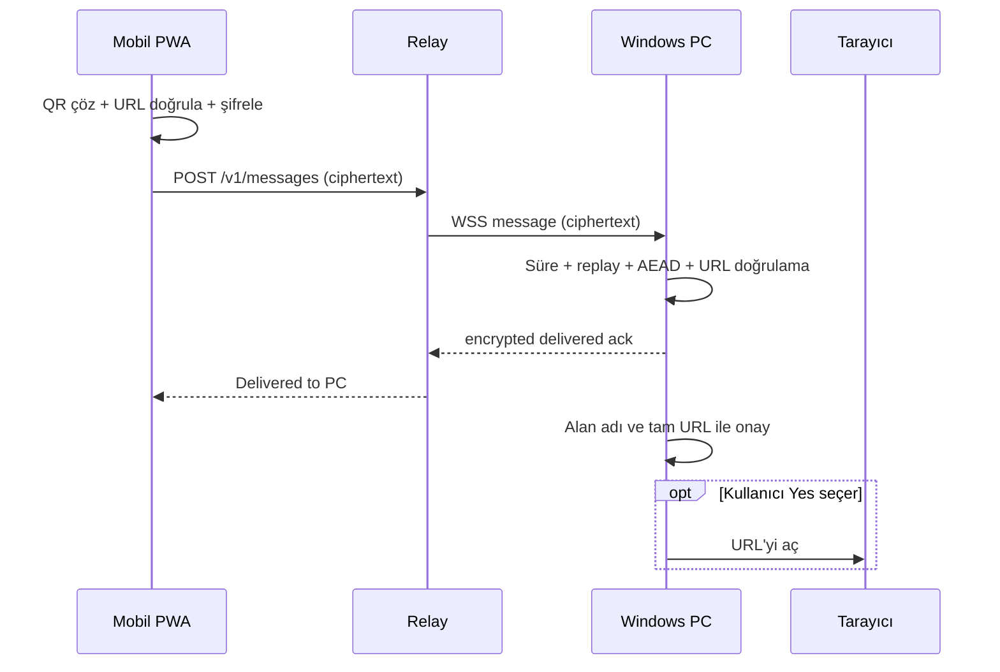

# Telefon-PC Köprüsü v0.2 — Teknik Tasarım

## Belge durumu

| Alan | Değer |
|---|---|
| Durum | Aşama 1 kısmen tamamlandı; Aşama 2 DPAPI dilimi uygulandı |
| Hedef uygulama sürümü | `v0.2.0` |
| Protokol sürümü | `wqrs/1` |
| Tarih | 30 Temmuz 2026 |
| İlk masaüstü hedefi | Windows |
| Mobil hedef | Kurulum zorunluluğu olmayan PWA |
| İlk doğrulama sırası | Android Chrome → iOS Safari |

Bu belge normatif kodun yerine geçmez. Kapsamı, güvenlik sınırlarını, mesaj
biçimlerini, uygulama durumunu ve kabul ölçütlerini birlikte izlemek için
hazırlanmıştır.

Normatif `wqrs/1` şemaları, deterministik test vektörü ve tehdit modeli kontrol
listesi [`protocol/`](../protocol/README.md) altında sürüm kontrollüdür.

## 1. Karar özeti

`v0.2` için alınan ana kararlar şunlardır:

- Kullanıcı hesabı veya e-posta zorunluluğu olmayacak.
- Telefon ile PC aynı yerel ağda olmak zorunda olmayacak.
- Telefon mobil veri kullanırken evde açık olan PC'ye bağlantı gönderebilecek.
- PC dışarıdan bağlantı kabul etmeyecek; kendisi relay sunucusuna dışarı doğru
  güvenli bir `wss://` bağlantısı açacak.
- Telefon, bağlantıyı relay'e `https://` üzerinden gönderecek.
- URL telefonda şifrelenecek ve yalnızca eşleştirilmiş PC'de çözülebilecek.
- Relay sunucusu URL'yi veya QR içeriğini okuyamayacak.
- İlk eşleştirme, PC'nin gösterdiği kısa süreli QR ile yapılacak.
- Her iki cihazda altı haneli kod karşılaştırılmayacak.
- Telefonun QR'ı okutması ilk kullanıcı eylemi, PC'deki tek seferlik onay ise
  ikinci güvenlik adımı olacak.
- Sonraki gönderimlerde yeniden eşleştirme istenmeyecek.
- PC, gelen bağlantıyı varsayılan olarak otomatik açmayacak; gönderen cihazı,
  alan adını ve tam URL'yi göstererek onay isteyecek.
- `v0.2.0` relay üzerinde çevrimdışı mesaj saklamayacak.
- PC çevrimdışıysa telefon “PC çevrimdışı” sonucunu gösterecek ve kullanıcı
  yeniden deneyebilecek.
- Kalıcı şifreli kuyruk, zamanlayıcı ve hatırlatma `v0.2.1` kapsamına kalacak.
- Yerel ağ üzerinden doğrudan iletişim `v0.2.2` kapsamına kalacak.
- İlk protokol yalnızca web bağlantısı taşıyacak; dosya, komut, pano içeriği,
  Wi-Fi parolası veya çalıştırılabilir veri taşımayacak.
- Mobil istemci, mağazadan indirilen native uygulama yerine HTTPS üzerinden
  açılan ve isteğe bağlı ana ekrana eklenen bir PWA olacak.
- PWA kamerayı yalnızca kullanıcı **Scan QR** seçtiğinde açacak ve sonuçta
  **Open on this phone** ile **Send to PC** seçeneklerini gösterecek.
- Tarayıcı kriptografisi için harici JavaScript/WASM kripto paketi
  kullanılmayacak; desteklenmeyen tarayıcı fail-closed davranacak.

## 2. Amaçlar

### 2.1 Kullanıcı amacı

Kullanıcı telefonda bir QR kod okuttuğunda bağlantıyı birkaç saniye içinde açık
olan ve daha önce eşleştirilmiş PC'ye gönderebilmelidir. PC bağlantıyı güvenli
bir onay penceresinde göstermeli ve kullanıcı izin verirse varsayılan tarayıcıda
açmalıdır.

### 2.2 Teknik amaçlar

- NAT, modem ayarı veya port yönlendirme gerektirmemek.
- Yerel ağ ve konum izni gerektirmemek.
- Relay ele geçirilse bile URL içeriğini gizli tutmak.
- Sahte gönderici, mesaj değiştirme ve tekrar oynatma saldırılarını engellemek.
- PC çevrimdışıyken yanlış biçimde “bağlantı açıldı” sonucu göstermemek.
- Mevcut kamera ve ekran tarama özelliklerinin performansını bozmamak.
- Protokolü Browser WebCrypto, Python ve bağımsız Node.js arasında aynı test
  vektörleriyle uygulamak.
- Relay'i açık kaynak ve kendi sunucusunda çalıştırılabilir tutmak.

## 3. Kapsam dışı

Aşağıdakiler `v0.2.0` içinde yapılmayacaktır:

- Relay üzerinde mesaj kuyruğu veya şifreli mesaj saklama
- PC kapalıyken otomatik açma
- Zamanlayıcı ve işletim sistemi hatırlatması
- Kullanıcı hesabı, parola sıfırlama veya bulut anahtar yedeği
- Uzak masaüstü kontrolü
- Dosya gönderme
- Panoyu uzaktan değiştirme
- Bilgisayarda komut veya uygulama çalıştırma
- Yerel ağ cihaz keşfi
- GPS veya yaklaşık konum izni
- Otomatik ve onaysız URL açma
- Çoklu PC senkronizasyonu
- App Store veya Play Store üzerinden dağıtılan native mobil uygulama
- İşletim sistemi kamera uygulamasına özel **Send to PC** düğmesi ekleme

Bu sınırlar güvenlik ve geliştirme süresini kontrol altında tutmak için
bilinçlidir. “Sadece URL gönderme” kuralı, köprünün uzaktan komut çalıştırma
aracına dönüşmesini engeller.

## 4. Üst düzey mimari



### 4.1 Neden relay gerekiyor?

Evdeki PC çoğunlukla modem arkasındadır ve internete açık bir IP/port sunmaz.
PC'nin relay'e dışarı doğru WebSocket bağlantısı açması, port yönlendirme
gereksinimini kaldırır. WebSocket iki yönlü mesajlaşmaya uygundur ve `wss://`
ile TLS üzerinden çalışır.

### 4.2 Relay'in rolü

Relay:

- çevrimiçi PC bağlantısını tutar;
- eşleştirme isteğini doğru PC'ye yönlendirir;
- şifreli mesajı doğru PC'ye iletir;
- cihaz ve eşleşme yetki belirteçlerini doğrular;
- hız ve boyut sınırı uygular;
- PC'den teslim alındı cevabını telefona iletir.

Relay şunları yapmaz:

- URL'yi çözmez;
- QR içeriğini analiz etmez;
- tarayıcı açmaz;
- `v0.2.0` içinde çevrimdışı mesaj saklamaz;
- uçtan uca şifreleme anahtarlarına sahip olmaz.

## 5. Bileşenler

### 5.1 Windows masaüstü alıcısı

Mevcut Python uygulamasına `--bridge` çalışma modu, sistem tepsisi ve kalıcı ağ
alıcısı eklenmiştir. Denetleyici kamera açmadan arka planda çalışır. Kayıtlı bir
eşleşme varsa aynı relay cihazına ait telefonları tek dışa doğru bağlantı/poll
grubunda dinler. Kullanıcının **Pair Phone...** işlemi yapılandırılmış relay'e
bağlanır, iki dakikalık QR gösterir, varsayılan ret seçili PC onayını ister ve
onaylanan eşleşmeyi DPAPI ile saklar.

Sorumlulukları:

- PC kimlik anahtarını oluşturmak ve güvenli saklamak;
- localhost geliştirme relay'ine dışarı doğru `ws://`, üretim HTTPS relay'ine
  kimlik doğrulamalı kısa `GET` polling istekleri göndermek;
- eşleştirme QR'ı oluşturmak;
- eşleştirme isteğini kullanıcıya göstermek;
- telefon eşleşmelerini listelemek ve iptal etmek;
- şifreli mesajı doğrulamak ve çözmek;
- URL'yi yeniden doğrulamak;
- gönderen telefon, alan adı ve tam adresle onay istemek;
- onay verilirse mevcut `open_web_url()` davranışını kullanmak;
- tekrar oynatma kayıtlarını URL saklamadan tutmak.

Kabul edilen masaüstü yaşam döngüsü şöyledir:

- Kullanıcıya tek `QR-Scanner.exe` dağıtılır.
- EXE normal açılışta hafif sistem tepsisi denetleyicisini ve ayrı kamera
  sürecini başlatır.
- Kamera bir On/Off ayarı değil, kullanıcı tarafından başlatılan bir işlemdir.
- `Esc`, pencere kapatma düğmesi veya başarılı QR okuması yalnızca kamera
  sürecini kapatır; ardından sade kontrol ekranı açılır.
- Kontrol ekranı kamera, ekran taraması ve telefon eşleştirmesini görünür
  seçenekler olarak sunar; kapatılırsa denetleyici tepside kalır.
- Kameradayken `Ctrl+Q` veya tepsideki **Exit QR Scanner**, onaydan sonra tüm
  süreçleri kapatır.
- İkinci EXE açılışı ikinci denetleyici veya kamera oluşturmaz; mevcut tepsi
  örneğine kamera açma isteği iletir.
- **Start with Windows** varsayılan kapalıdır ve yalnızca denetleyiciyi başlatır.
- Kamera ile ekran tarama süreçleri ağ alıcısından ayrıdır; relay sorunu yerel
  QR taramasını bozmamalıdır.
- Ekran taramasında farklı QR içerikleri bulunursa fare yakınlığı yalnızca
  vurguyu belirler; kullanıcı görünür QR sınırına tıklamadan seçim yapılmaz ve
  mevcut alan adı onayı korunur.

Tepsi temelinde şu işlemler bulunur:

- **Open QR Scanner**
- **Scan with Camera**
- **Scan Screen**
- **Phone-to-PC status**
- **Pair Phone...** — geliştirme relay'iyle çalışan kısa ömürlü eşleştirme akışı
- **Start with Windows**
- **Exit QR Scanner**

`--bridge` modu kamera veya ekran yakalama izni istemeyecektir.

### 5.2 Mobil PWA

Mobil istemci, HTTPS üzerinden sunulan install-optional bir Progressive Web App
olacaktır. Kullanıcı siteyi doğrudan tarayıcıda kullanabilir; isterse ana
ekranına ekleyebilir. App Store veya Play Store kurulumu zorunlu değildir.

PWA'nın birinci sınıf hedefleri güncel Android Chrome ve iOS Safari'dir.
Tarayıcı adı veya user-agent metnine güvenmek yerine kamera ve WebCrypto
özellikleri çalışma anında sınanır. Gereken özellik eksikse zayıf bir kripto
geri dönüşü kullanılmaz; anlaşılır bir uyumluluk mesajı gösterilir.

Sorumlulukları:

- yalnızca kullanıcı **Scan QR** seçtiğinde `getUserMedia()` ile kamerayı açmak;
- QR çözümlemeyi cihaz üzerinde yapmak;
- yalnızca geçerli URL'leri kabul etmek;
- eşleştirme QR'ını işlemek;
- eşleşme anahtarını aynı-origin IndexedDB içinde non-extractable `CryptoKey`
  olarak saklamak;
- URL'yi tarayıcının yerleşik WebCrypto API'siyle cihazda şifrelemek;
- şifreli zarfı relay'e göndermek;
- “gönderildi”, “PC çevrimdışı” veya güvenli hata sonucu göstermek;
- eşleştirilmiş PC'leri listelemek ve telefondan kaldırmak.

İlk sürümde kullanıcı **Scan QR** düğmesine basarak niyetini açıkça belirtir.
Kararlı bir URL bulunduğunda PWA otomatik göndermek yerine **Open on this
phone** ve **Send to PC** seçeneklerini gösterir. Ayrı bir altı haneli kod veya
her gönderimde ikinci bir telefon onayı istenmez. PC onayı korunur.

PWA:

- konum izni istemeyecek;
- mikrofon izni istemeyecek;
- fotoğraf galerisi izni istemeyecek;
- kamera karelerini kaydetmeyecek veya relay'e yüklemeyecek;
- QR çözümlemeyi cihaz üzerinde yapacak;
- reklam, analytics veya üçüncü taraf script yüklemeyecek;
- taranan ve gönderilen URL geçmişini saklamayacak;
- service worker önbelleğine URL, token veya anahtar yazmayacak.

QR çözümlemede önce tarayıcının yerleşik desteği feature-detection ile
değerlendirilir. iOS/Android uyumluluğu için fallback gerekirse yalnızca QR
çözümleyen, izinleri ve lisansı incelenmiş bir bağımlılık sabit sürümle
paketlenebilir. Kriptografik işlemler için böyle bir fallback yasaktır.

### 5.3 Relay servisi

Uygulanan internet relay teknolojisi:

- PWA ile aynı Cloudflare Worker içindeki TypeScript API;
- TLS sağlayan yönetilen Sites dağıtımı;
- kalıcı yönlendirme durumu ve migration'lar için D1/SQLite;
- WebSocket/Durable Object zorunluluğu oluşturmayan kısa HTTP polling;
- yerel protokol testleri için ayrıca localhost FastAPI/WebSocket relay'i.

Bu seçim ilk MVP'de ayrı sunucu veya ücretli PostgreSQL zorunluluğunu kaldırır.
Yük veya gecikme gereksinimi büyürse relay ayrı bir origin ve servis olarak
taşınabilir; `wqrs/1` içindeki `relay_origin` bağı bunu destekler.

Relay veritabanında yalnızca aşağıdaki kayıtlar bulunur:

- rastgele cihaz kimliği;
- alıcı yetki belirtecinin HMAC özeti;
- eşleşme kimliği;
- gönderici yetki belirtecinin HMAC özeti;
- iptal durumu;
- oluşturulma ve son kullanım zamanı;
- hız sınırı sayaçları için gerekli kısa ömürlü bilgiler.

URL, QR içeriği, tarayıcı geçmişi ve çözme anahtarları veritabanına yazılmaz.

## 6. Güven sınırları ve görülebilen veriler

| Veri | Mobil PWA | Relay | PC |
|---|---:|---:|---:|
| QR/URL düz metni | Evet | Hayır | Evet |
| Uçtan uca kök anahtar | Evet | Hayır | Evet |
| Gönderici relay token'ı | Evet | TLS sırasında görür | Hayır |
| Eşleşme kimliği | Evet | Evet | Evet |
| Mesaj kimliği | Evet | Evet | Evet |
| Şifreli mesaj | Evet | Evet | Evet |
| Telefon IP adresi | Hayır | Evet | Hayır |
| PC IP adresi | Hayır | Evet | Hayır |
| Bağlantı zamanı ve yaklaşık boyut | Evet | Evet | Evet |

Önemli gizlilik gerçeği: Uygulama GPS veya işletim sistemi konum izni istemez.
Ancak internetteki her servis gibi relay, bağlanan IP adresini teknik olarak
görür. IP adresi yaklaşık bölge tahmini için kullanılabilir. Bu nedenle `v0.2`
yayınlanırken gizlilik metni, tamamen yerel çalışan `v0.1` metninden farklı
olmalıdır.

## 7. Kriptografik tasarım

### 7.1 İlke

Kriptografik algoritmalar elle yazılmayacaktır. PC'de incelenmiş kütüphanelerin,
PWA'da tarayıcının yerleşik WebCrypto API'sinin yüksek seviyeli işlemleri
kullanılacaktır. PC ve PWA aynı test vektörlerini geçmeden relay ile gerçek veri
gönderemeyecektir.

### 7.2 Algoritma takımı

`wqrs/1` için:

| Amaç | Algoritma |
|---|---|
| Anahtar anlaşması | ECDH, NIST P-256 |
| Anahtar türetme | HKDF-SHA-256 |
| Mesaj şifreleme ve bütünlük | AES-256-GCM AEAD |
| Özet | SHA-256 |
| Relay token özeti | Sunucu pepper'ı ile HMAC-SHA-256 |
| Rastgelelik | İşletim sistemi CSPRNG |
| JSON kanonikleştirme | RFC 8785 JCS |
| Taşıma güvenliği | HTTPS/WSS, TLS 1.2+; TLS 1.3 tercih |

AES-256-GCM için:

- anahtar 32 bayt;
- IV 12 bayt;
- tam 16 bayt doğrulama etiketi;
- aynı anahtarla IV tekrarına izin verilmez.

Her mesaj için ayrı anahtar türetileceği için rastgele IV çakışmasının etkisi
de sınırlandırılır.

Bu takım tarayıcıda harici kripto paketi gerektirmeden WebCrypto ile
uygulanabilir. P-256 yaklaşık 128 bit güvenlik seviyesi sunar. Açık anahtarlar
65 baytlık SEC1/X9.62 sıkıştırılmamış nokta (`0x04 || X || Y`) olarak taşınır
ve eğri doğrulaması platform kripto API'sine bırakılır.

### 7.3 Boyutlar

| Alan | Boyut |
|---|---:|
| PC P-256 özel skaler | 32 bayt |
| PC P-256 açık anahtar | 65 bayt |
| PWA geçici P-256 özel skaler | 32 bayt |
| PWA P-256 açık anahtar | 65 bayt |
| `pairing_secret` | 32 bayt |
| `pairing_relay_token` | 32 bayt |
| `receiver_token` | 32 bayt |
| `sender_token` | 32 bayt |
| `device_id` | 16 bayt |
| `pairing_id` | 16 bayt |
| `pair_id` | 16 bayt |
| `message_id` | 16 bayt |
| AEAD IV | 12 bayt |
| Kök anahtar | 32 bayt |

İkili alanlar URL güvenli, dolgusuz Base64 ile taşınacaktır. Kimlik ve token'lar
`random` modülüyle değil işletim sistemi CSPRNG'siyle üretilecektir.

### 7.4 Ayrı anahtarlar

ECDH P-256 ortak sırrı doğrudan şifreleme anahtarı olarak kullanılmaz.

```text
shared_secret = ECDH-P256(phone_private, pc_public)
transcript_hash = SHA256(JCS(pairing_transcript))

handshake_key = HKDF-SHA256(
    ikm=shared_secret,
    salt=pairing_secret,
    info="wqrs/handshake/v1" || transcript_hash,
    length=32
)

root_key = HKDF-SHA256(
    ikm=shared_secret,
    salt=pairing_secret,
    info="wqrs/root/v1" || transcript_hash,
    length=32
)
```

Eşleştirme mesajları yalnızca `handshake_key`, normal bağlantı mesajları
`root_key` üzerinden türetilen mesaj anahtarlarıyla korunur.

```text
message_key = HKDF-SHA256(
    ikm=root_key,
    salt=message_id,
    info="wqrs/message-key/v1",
    length=32
)
```

Bu ayrım, aynı anahtarın farklı protokol amaçlarında kullanılmasını engeller.

`pairing_transcript`; protokol sürümü, normalize relay origin'i, `device_id`,
`pairing_id`, sona erme zamanı ve iki P-256 açık anahtarından oluşur.
`pairing_secret` transcript içine yazılmaz; HKDF salt girdisi olarak kullanılır.
Her şifreli pairing mesajı ayrı, rastgele 12 bayt IV kullanır ve mesaj türünü
AEAD ilişkili verisine bağlar.

### 7.5 İleri gizlilik sınırı

`wqrs/1` tam bir Signal Double Ratchet protokolü değildir. Eşleşmenin kök
anahtarı sonradan ele geçirilirse daha önce kaydedilmiş şifreli mesajlar teorik
olarak çözülebilir. Relay `v0.2.0` içinde mesaj saklamadığı ve taşıma ayrıca TLS
ile korunduğu için risk azaltılır, fakat sıfırlanmaz.

Bu sınır belgede ve güvenlik incelemesinde açıkça tutulacaktır. Daha güçlü ileri
gizlilik gerekirse standart ve denetlenmiş bir ratchet/Noise tabanlı protokol
ayrı bir sürümde değerlendirilir; `v0.2` içinde özel bir ratchet algoritması
icat edilmeyecektir.

## 8. Anahtarların cihazda saklanması

### 8.1 Windows

Şunlar Windows DPAPI ile mevcut kullanıcı hesabına ve bilgisayara bağlı biçimde
korunacaktır:

- PC özel kimlik anahtarı;
- `receiver_token`;
- her telefon için `root_key`;
- eşleşme etiketi ve protokol sürümü.

30 Temmuz 2026 tarihli masaüstü diliminde relay `device_id`/`receiver_token`
kaydı, her onaylanan telefonun `pair_id`, `root_key`, etiketi ve `key_epoch`
değeri atomik olarak yazılan tek DPAPI ciphertext dosyasında uygulanmıştır.
Düz metin geri dönüşü yoktur; DPAPI çözme veya doğrulama başarısız olursa işlem
fail-closed davranır. Kalıcı PC kimlik anahtarı ve replay deposu, gerçek ağ
alıcısıyla birlikte tamamlanacaktır.

`CRYPTPROTECT_LOCAL_MACHINE` kullanılmayacaktır; aksi hâlde aynı bilgisayardaki
diğer kullanıcıların erişim sınırı gereksiz yere genişler.

URL geçmişi tutulmaz. Tekrar oynatma koruması için yalnızca mesaj kimliği
özetleri ve sona erme zamanları saklanır.

### 8.2 PWA

PWA kök anahtarı, `extractable: false` olarak içe aktarılmış bir HKDF
`CryptoKey` biçiminde aynı-origin IndexedDB içinde saklanır. `sender_token`,
eşleşme kimliği, PC etiketi ve `key_epoch` aynı kayıtta bulunur. URL geçmişi,
QR görüntüsü ve kamera karesi saklanmaz.

Bu depolama native Keystore/Keychain ile aynı güvenlik garantisini vermez:

- kullanıcı site verisini temizlerse eşleşme kaybolur ve yeniden yapılır;
- gizli veya geçici tarama modunda kalıcılık garanti edilmez;
- tarayıcı depolama alanını tahliye edebilir;
- aynı origin'de çalışabilen zararlı JavaScript, non-extractable anahtarı dışarı
  aktaramasa bile kripto işlemi yaptırabilir ve düz URL'yi okuyabilir.

Bu nedenle PWA statik ve sürümlü asset olarak dağıtılır; katı Content Security
Policy kullanır, üçüncü taraf script çalıştırmaz, bağımlılıkları kilitler ve
relay'den ayrı dağıtım yetkileriyle barındırılır. Service worker yalnızca
uygulama kabuğunu önbelleğe alır; IndexedDB içeriğini, URL'leri veya ağ
cevaplarını kendi cache'ine kopyalamaz.

### 8.3 Silme ve iptal

- PC'de telefon kaldırıldığında yerel kök anahtar silinir ve relay eşleşmesi
  iptal edilir.
- PWA'da PC kaldırıldığında IndexedDB içindeki kök anahtar ve sender token
  silinir.
- Telefon kaybolursa PC'deki **Paired devices** ekranından eşleşme iptal edilir.
- İlk sürümde anahtar döndürme, eşleşmeyi iptal edip yeniden eşleştirmedir.
- Protokol mesajlarında gelecekteki döndürme için `key_epoch: 1` alanı bulunur.
- Pairing tamamlanınca iki taraf da `pairing_secret`, `handshake_key`, ECDH
  ortak sırrı ve PWA'daki geçici P-256 özel anahtarı bellekten temizlemeye
  çalışır. Çöp toplayıcılı dillerde kesin silme garanti edilemese de değerler
  kalıcı depoya yazılmaz ve referanslar hemen bırakılır.

## 9. İlk eşleştirme protokolü

### 9.1 Kullanıcı akışı

1. PC'de **Pair phone** seçilir.
2. PC, iki dakika geçerli bir QR gösterir.
3. Mobil PWA'da **Pair a computer** seçilir ve QR okutulur.
4. PWA şifreli eşleştirme isteğini relay üzerinden gönderir.
5. PC “Mobile browser eşleşmek istiyor” onayını gösterir.
6. Kullanıcı PC'de onaylarsa eşleşme tamamlanır.
7. PWA ve PC eşleşme anahtarlarını kendi kalıcı depolarına yazar.

Zorunlu altı haneli kod yoktur. QR'ı okutmak, PC açık anahtarını ve yüksek
entropili eşleştirme sırrını doğrudan telefona taşır. İsteğe bağlı ayrıntılar
ekranında bir güvenlik parmak izi gösterilebilir; normal kullanıcı akışını
engellemez.

### 9.2 QR içeriği

Örnek şema:

```text
wqrs://pair?
  v=1&
  relay=https%3A%2F%2Frelay.example&
  device=<base64url-16-byte>&
  pairing=<base64url-16-byte>&
  pairing_token=<base64url-32-byte>&
  pc_key=<base64url-65-byte-p256-public-key>&
  secret=<base64url-32-byte>&
  expires=1785100000
```

Gerçek QR tek satırdır. QR:

- iki dakika sonra geçersiz olur;
- bir kez kullanılabilir;
- relay alan adını açıkça içerir;
- PC açık anahtarını içerir;
- relay'in yalnızca bu oturuma erişim vermesi için `pairing_relay_token` içerir;
- relay'e gönderilmeyen `pairing_secret` değerini içerir.

Kullanıcı özel bir relay kullanıyorsa telefon alan adını gösterir. Resmî relay
dışındaki bir alan adı ilk kullanımda açık onay gerektirir.

### 9.3 Eşleştirme sırası



PWA pairing isteğinden sonra WebSocket açmaz. Relay'deki
`GET /v1/pairings/{pairing_id}/result` long-poll çağrısını en fazla 30 saniyelik
isteklerle tekrarlar. Relay, şifreli onay veya ret sonucunu yalnızca pairing
oturumu bitene kadar bellekte tutar; diske yazmaz. Relay yeniden başlarsa
eşleştirme baştan yapılır.

Şifreli `pair_approved` yükü `pair_id`, yüksek entropili `sender_token`, PC
etiketi ve `key_epoch` değerini içerir. PC relay'e sender token'ın kendisini
değil HMAC özetini kaydeder. PWA onayı doğruladıktan sonra `root_key` değerini
non-extractable CryptoKey, `sender_token` değerini origin'e bağlı uygulama
verisi olarak IndexedDB'ye yazar.

### 9.4 Onay içeriği

PC onay penceresi şunları gösterir:

- kullanıcının PWA'da verdiği cihaz etiketi;
- istemci türü: **Mobile PWA**;
- istek zamanı;
- relay alan adı;
- **Approve** ve varsayılan **Reject** düğmeleri.

Cihaz etiketi güvenilir kimlik değildir; yalnızca kullanıcıya yardımcı etikettir.
Güven, QR içindeki sır ve kriptografik doğrulamadan gelir.

### 9.5 Eşleştirme saldırılarına karşı koruma

- `pairing_id` tahmin edilemez 128 bit değerdir.
- `pairing_relay_token` 256 bittir, yalnızca Authorization başlığında taşınır
  ve relay'de HMAC özetiyle doğrulanır.
- `pairing_secret` 256 bittir ve relay'e verilmez.
- PC açık anahtarı QR'dan geldiği için relay anahtar değiştiremez.
- AEAD ilişkili verisi PC anahtarı, telefon anahtarı, süre ve kimlikleri bağlar.
- Oturum iki dakika sonra silinir.
- İlk geçerli ve kullanıcı tarafından onaylanan istekten sonra oturum kapanır.
- PC onayı olmadan kalıcı sender token üretilmez.
- Aynı eşleştirme isteğinin tekrarı reddedilir.

## 10. Normal URL gönderme protokolü

### 10.1 PWA davranışı

1. Kullanıcı **Scan QR** seçer.
2. QR cihaz üzerinde çözülür.
3. Değer URL doğrulamasından geçer.
4. PWA **Open on this phone** ve **Send to PC** seçeneklerini gösterir.
5. Kullanıcı **Send to PC** seçerse PWA `message_id`, süre ve nonce üretir.
6. Mesaj anahtarı türetilir.
7. URL AES-256-GCM ile şifrelenir.
8. Şifreli zarf relay'e gönderilir.
9. PC doğrulayıp teslim aldığında PWA **Delivered to PC** gösterir.

“Delivered” bağlantının açıldığı anlamına gelmez. PC kullanıcısının onay veya
ret kararı PWA'ya bildirilmez; gereksiz davranış takibi yapılmaz.

PWA yalnızca PC'nin oluşturduğu şifreli ACK doğrulanırsa **Delivered to PC**
gösterir. Relay isteği yönlendirmiş olsa bile geçerli ACK yoksa
`delivery_timeout` sonucu gösterilir.

### 10.2 PC davranışı

1. Relay token doğrulamasından geçen zarfı WSS üzerinden iletir.
2. PC protokol sürümü, boyut, süre ve mesaj kimliğini kontrol eder.
3. Mesaj daha önce işlenmişse reddeder.
4. İlgili eşleşmenin kök anahtarını DPAPI'den çözer.
5. Mesaj anahtarını türetir ve AEAD doğrulaması yapar.
6. URL'yi düz metin elde edildikten sonra yeniden doğrular.
7. Gönderen PWA cihaz etiketi, Punycode alan adı ve tam URL gösterilir.
8. Varsayılan **No** olur.
9. Kullanıcı **Yes** seçerse tarayıcı açılır.
10. URL değeri günlük veya geçmiş dosyasına yazılmaz.

### 10.3 Mesaj sırası



## 11. Mesaj biçimleri

Tüm HTTP mesajları UTF-8 JSON'dur. Bilinmeyen zorunlu alan veya desteklenmeyen
protokol sürümü fail-closed davranışıyla reddedilir.

### 11.1 Şifreli mesaj zarfı

```json
{
  "protocol": "wqrs/1",
  "type": "url_message",
  "pair_id": "BASE64URL_PAIR_ID",
  "key_epoch": 1,
  "message_id": "BASE64URL_MESSAGE_ID",
  "created_at": 1785100000,
  "expires_at": 1785100300,
  "nonce": "BASE64URL_12_BYTE_NONCE",
  "ciphertext": "BASE64URL_CIPHERTEXT_AND_TAG"
}
```

AEAD ilişkili verisi, `ciphertext` hariç zarfın RFC 8785 JCS ile
kanonikleştirilmiş UTF-8 biçimidir. Böylece relay'in görünür alanları
değiştirmesi doğrulamayı bozar.

### 11.2 Düz metin yükü

```json
{
  "payload_version": 1,
  "kind": "url",
  "url": "https://example.com/path"
}
```

Sayfa başlığı, tarayıcı geçmişi, konum veya cihaz kimliği yük içinde bulunmaz.

### 11.3 Teslim ACK'i

PC URL mesajını başarıyla doğrulayıp çözdükten sonra aşağıdaki en küçük yükü
şifreler:

```json
{
  "payload_version": 1,
  "kind": "delivered",
  "message_id": "BASE64URL_MESSAGE_ID"
}
```

ACK anahtarı, mesaj anahtarından ayrı türetilir:

```text
ack_key = HKDF-SHA256(
    ikm=root_key,
    salt=message_id,
    info="wqrs/ack-key/v1",
    length=32
)
```

ACK rastgele 12 bayt nonce kullanır ve `pair_id`, `message_id`, `key_epoch` ile
süreyi ilişkili veriye bağlar. D1 relay şifreli ACK'i en fazla 10 saniyelik
ömrü boyunca geçici olarak tutar; PWA kısa polling ile alır ve yerel WebCrypto
ile doğrular. Relay ACK'i üretemez veya değiştiremez.

### 11.4 URL kuralları

- En fazla 4096 UTF-8 bayt
- Yalnızca `https://` ve `http://`
- Host zorunlu
- Kullanıcı adı/parola içeren URL reddedilir
- Kontrol karakterleri reddedilir
- Geçersiz port reddedilir
- `javascript:`, `file:`, `data:`, `intent:` ve özel uygulama şemaları reddedilir
- Unicode alan adı onay penceresinde Punycode olarak da gösterilir
- `http://` bağlantıda ayrıca şifrelenmemiş web bağlantısı uyarısı gösterilir
- Yönlendirme sonrası hedef tarayıcının sorumluluğundadır

Uygulama web sitesinin güvenilirliğini garanti etmez. Şema ve yapı doğrulaması,
phishing veya zararlı site tespiti değildir.

## 12. Relay API taslağı

Kesin OpenAPI dosyası uygulama aşamasında oluşturulacaktır. İlk yüzey:

| İşlem | Yöntem ve yol | Kimlik doğrulama |
|---|---|---|
| PC kaydı | `POST /v1/devices` | İlk kurulum, TLS + hız sınırı |
| PC heartbeat/mesaj alma | `GET /v1/devices/{device_id}/messages` | Receiver bearer token |
| Pairing açma | `POST /v1/pairings` | Receiver bearer token |
| Pairing isteği | `POST /v1/pairings/{pairing_id}/request` | Pairing bearer token |
| Pairing isteğini alma | `GET /v1/pairings/{pairing_id}/request` | Receiver bearer token |
| Telefon sayfası açıldı | `POST /v1/pairings/{pairing_id}/opened` | Pairing bearer token |
| Telefon pairing ekranını kapattı | `POST /v1/pairings/{pairing_id}/phone-cancel` | Pairing bearer token |
| Pairing iptali | `DELETE /v1/pairings/{pairing_id}` | Receiver bearer token |
| Pairing sonucunu yazma | `POST /v1/pairings/{pairing_id}/result` | Receiver bearer token |
| Pairing sonucunu alma | `GET /v1/pairings/{pairing_id}/result` | Pairing bearer token |
| Pair onayı kaydı | `POST /v1/pairs` | Receiver bearer token |
| URL gönderme | `POST /v1/pairs/{pair_id}/messages` | Sender bearer token |
| Teslim durumunu alma | `GET /v1/pairs/{pair_id}/deliveries/{delivery_id}` | Sender bearer token |
| Teslim alındısı yazma | `POST /v1/devices/{device_id}/deliveries/{delivery_id}` | Receiver bearer token |
| Pair iptali | `DELETE /v1/pairs/{pair_id}` | Receiver bearer token |
| Sağlık kontrolü | `GET /healthz` | Yok, veri içermez |

### 12.1 Hata modeli

```json
{
  "error": {
    "code": "receiver_offline",
    "message": "The paired computer is offline.",
    "retry_after_seconds": 15
  }
}
```

İstemciler İngilizce sunucu mesajını doğrudan göstermeyecek; `code` alanını
yerel dile çevirecektir.

Önemli durumlar:

- `invalid_request`
- `unsupported_protocol`
- `unauthorized`
- `pairing_expired`
- `pairing_already_used`
- `pair_revoked`
- `receiver_offline`
- `message_expired`
- `message_too_large`
- `rate_limited`
- `delivery_timeout`

## 13. Süreler, tekrar ve sıralama

- Eşleştirme QR süresi: 120 saniye
- Normal mesaj süresi: 300 saniye
- İzin verilen saat farkı: en fazla 120 saniye
- PWA teslim alındısı bekleme üst sınırı: 15 saniye
- Pairing result polling aralığı: 500 ms
- Telefonun `opened` sinyali yalnızca geçici QR penceresini kapatır; cihazı
  doğrulamaz ve pairing onayı yerine geçmez. `phone-cancel` yalnızca henüz
  kullanılmamış kısa ömürlü oturumu iptal eder.
- PC mesaj/heartbeat polling aralığı: 1 saniye
- PC çevrimiçi heartbeat eşiği: 15 saniye
- D1 teslim lease süresi: 8 saniye
- Mesaj gövdesi üst sınırı: 12 KiB

PC, başarılı kimlik doğrulamadan sonra `message_id` özetini en az 24 saat
saklar. Aynı kimlik tekrar gelirse URL çözülse bile kullanıcıya gösterilmez.
Kayıt yalnızca mesaj kimliği özeti ve sona erme zamanıdır; URL içermez.

## 14. Çevrimdışı davranış

### `v0.2.0`

- Son PC heartbeat'i 15 saniyeden eskiyse relay mesajı kabul etmez.
- PC mesaj kabul edildikten hemen sonra bağlantıyı kaybederse yalnızca şifreli
  zarf, protokoldeki en fazla 300 saniyelik süre dolana kadar D1'da kalabilir.
- PWA `receiver_offline` sonucu alır.
- Mevcut ekran URL'yi yalnızca geçici bellekte tutabilir ve **Retry** sunabilir.
- PWA sekmesi kapatılırsa gönderilmemiş URL'nin korunacağı garanti edilmez.
- Sessiz otomatik tekrar veya arka plan gönderimi yapılmaz.

### `v0.2.1`

- URL PWA'nın origin'e bağlı şifreli yerel kuyruğuna yazılır.
- Kullanıcı süre ve hatırlatma seçebilir.
- Relay yine mümkün olduğunca içerik saklamaz.
- Süresi dolan öğe otomatik silinir.
- Otomatik açma ayrı ve açık bir kullanıcı tercihi olmadan etkinleşmez.
- Tarayıcı arka plan çalışmasını garanti etmediği için zamanında gönderim veya
  hatırlatma garantisi verilmez; destek düzeyi feature-detection ile gösterilir.

Bu ayrım MVP'yi küçük tutar ve “PC kapalıysa ne oldu?” davranışını belirsiz
bırakmaz.

## 15. Tehdit modeli

### 15.1 Korunması hedeflenen tehditler

| Tehdit | Kontrol |
|---|---|
| Relay veritabanının okunması | URL uçtan uca şifreli; anahtar relay'de yok |
| Relay'in mesajı değiştirmesi | AEAD etiketi ve ilişkili veri |
| Ağ dinleme | TLS + uçtan uca şifreleme |
| Sahte telefon mesajı | Sender token + eşleşme kök anahtarı |
| Tahmin edilen cihaz kimliği | Kimlik tek başına yetki değildir |
| Mesaj tekrarı | Rastgele `message_id`, süre ve kalıcı replay kaydı |
| Eski pairing QR kullanımı | 120 saniye, tek kullanım, PC onayı |
| Relay API flood | Boyut sınırı, hız sınırı, timeout ve kota |
| Zararlı URL şeması | Sıkı URL doğrulaması |
| Ekran dışı otomatik açma | PC'de varsayılan No ile kullanıcı onayı |
| Kaybolan telefon | PC'den pair iptali |

### 15.2 Tam olarak korunamayan durumlar

- Telefon işletim sistemi veya tarayıcı süreci ele geçirilmişse saldırgan
  telefondaki URL ve etkin anahtarları görebilir.
- PWA origin'i veya statik asset dağıtımı ele geçirilirse zararlı JavaScript
  kullanıcı URL'sini şifrelenmeden önce görebilir ve kayıtlı anahtarlarla işlem
  yaptırabilir. Non-extractable `CryptoKey` bu origin ele geçirilmesini çözmez.
- Tarayıcı site verisini silebilir; bu veri kaybı güvenlik ihlali değildir fakat
  yeniden eşleştirme gerektirir.
- PC ele geçirilmişse çözülen URL ve tarayıcı davranışı görülebilir.
- Kullanıcı sahte alan adına bilerek **Yes** derse uygulama bunu engelleyemez.
- Hedef web sitesi IP, çerez ve tarayıcı bilgilerini görebilir.
- Relay mesajı düşürebilir, geciktirebilir veya hizmeti tamamen durdurabilir.
- Relay IP, zamanlama, mesaj boyutu ve eşleşme ilişkisi gibi metadatayı görebilir.
- `wqrs/1` tam ileri gizlilik sağlamaz.
- Ekran kaydedici veya fiziksel kamera eşleştirme QR'ını görebilir; kısa süre ve
  PC onayı bu riski azaltır.

Bu sınırlamalar pazarlama metninde “tam anonim” veya “relay hiçbir şey görmez”
gibi yanlış iddialar kullanılmasını engeller.

## 16. Relay kötüye kullanım kontrolleri

Başlangıç değerleri yapılandırılabilir olacaktır:

- cihaz kaydı: IP başına saatte 10;
- pairing oturumu: cihaz başına dakikada 5;
- pairing isteği: oturum başına 1 başarılı istek;
- mesaj: pair başına dakikada 30;
- mesaj gövdesi: en fazla 12 KiB;
- JSON iç içe derinliği: en fazla 8;
- tüm ağ ve veritabanı işlemleri için açık timeout;
- aşımda `429 Too Many Requests` ve `Retry-After`;
- iptal edilmiş pair için tek tip cevap;
- kimlik varlığını sızdırmamak için bilinmeyen ve iptal edilmiş kimliklerde
  mümkün olduğunca aynı hata yüzeyi.

Token'lar yüksek entropili olduğu için veritabanında düz metin tutulmaz.
Relay, sunucuya özel pepper ile HMAC özeti saklar. Authorization başlıkları
hiçbir loga yazılmaz. Receiver, pairing ve sender token'ları URL, query string
veya JSON gövdesine konmaz; yalnızca TLS ile korunan Authorization başlığında
taşınır.

## 17. Gizlilik ve günlük politikası

### Masaüstü ve PWA

Varsayılan olarak:

- URL geçmişi yok;
- QR görüntüsü yok;
- kamera karesi yok;
- ekran görüntüsü yok;
- analytics SDK yok;
- reklam SDK'sı yok;
- crash raporuna URL veya anahtar eklenmez;
- düz metin token veya anahtar loglanmaz.
- PWA üçüncü taraf analytics, reklam, font veya script origin'i çağırmaz.
- Service worker cache'inde URL, token, anahtar veya relay cevabı bulunmaz.

### Relay

Operasyonel loglar:

- istek türü;
- başarı/hata kodu;
- yaklaşık süre;
- yaklaşık gövde boyutu;
- geri döndürülemez, günlük dönen HMAC'li kimlik;
- güvenlik olayı için gerekli sınırlı IP bilgisi.

Loglar URL, ciphertext gövdesi, Authorization başlığı veya anahtar içermez.
Önerilen ham log saklama süresi yedi gündür. Kesin süre, relay'in barındırıldığı
ülke ve hizmet politikasına göre gizlilik belgesinde ilan edilir.

## 18. Güvenli kullanıcı deneyimi

### 18.1 Eşleştirme

- PC QR'ında geri sayım gösterilir.
- Süre dolunca QR anında geçersizleşir.
- PC onayı varsayılan **Reject** olur.
- Onaylanan telefon açık bir adla listelenir.
- Kullanıcı tek tıkla erişimi iptal edebilir.

### 18.2 Gelen bağlantı

Onay penceresi:

```text
Mobile browser sent a link

Website:
example.com

Full address:
https://example.com/path

Open it in the default browser?

[Yes] [No]
```

- **No** odaklı varsayılan seçimdir.
- `Esc` iptal eder.
- Alan adı tam adresten ayrı ve büyük gösterilir.
- Punycode karşılığı gizlenmez.
- HTTP bağlantıya ek uyarı verilir.
- Çok uzun adres sınırlı önizlenir, fakat açılacak tam değer değişmez.

### 18.3 Bildirim yorgunluğu

İlk sürümde güvenlik için her gelen URL PC onayı ister. Daha sonra “bu telefona
güven” seçeneği düşünülse bile:

- varsayılan kapalı olmalı;
- ayarlardan açıkça etkinleştirilmeli;
- HTTP ve şüpheli URL'lerde uygulanmamalı;
- kullanıcı kolayca geri alabilmeli;
- gizli bir varsayılan olarak eklenmemelidir.

## 19. Depo yapısı

Mevcut masaüstü dosyaları hemen taşınmayacaktır. İlk aşamada:

```text
webcam-qr-scanner/
├── launcher.py
├── tray_app.py
├── app_settings.py
├── bridge_signals.py
├── windows_startup.py
├── app.py
├── camera.py
├── screen_selector.py
├── ... mevcut masaüstü kodu
├── bridge/
│   ├── protocol.py
│   ├── pairing.py
│   ├── pairing_controller.py
│   ├── secure_storage.py
│   ├── receiver.py
│   ├── fake_phone.py
│   ├── fake_pairing_phone.py
│   ├── provision.py
│   └── replay.py
├── pairing_ui.py
├── relay/
│   ├── app.py
│   ├── state.py
│   └── server.py
├── pwa/
│   ├── src/
│   ├── public/
│   └── tests/
├── protocol/
│   ├── schemas/
│   └── test-vectors/
└── docs/
```

Bu monorepo düzeni protokol, relay ve istemci değişikliklerinin aynı commit ve
test vektörüyle gözden geçirilmesini sağlar. Mevcut masaüstü kodunu baştan
taşımak, ilk prototipe gereksiz risk ekleyeceği için ertelenir.
`secure_storage.py` içindeki DPAPI eşleşme deposu eklenmiştir. Kalıcı replay
deposu ve üretim relay migration'ları Aşama 2 ve Aşama 5 içinde
tamamlanacaktır.

## 20. Test stratejisi

### 20.1 Protokol testleri

- ECDH P-256 ortak sır test vektörleri
- HKDF-SHA-256 test vektörleri
- AES-256-GCM bilinen cevap testleri
- Python ve Browser WebCrypto'nun aynı zarfı çözmesi
- Browser WebCrypto ve Python'ın aynı zarfı üretmesi
- JCS kanonikleştirme uyumluluğu
- Bozuk tag, nonce, Base64 ve JSON reddi
- Desteklenmeyen protokol sürümü reddi
- Eski `key_epoch` reddi

Test vektörlerinde gerçek üretim anahtarı veya kullanıcı URL'si bulunmaz.

### 20.2 Güvenlik testleri

- Relay ciphertext içinden URL çıkaramıyor
- Relay veritabanı dökümünde düz token yok
- Authorization başlıkları loglanmıyor
- Tekrar edilen `message_id` ikinci kez açılmıyor
- Süresi dolan pairing ve mesaj reddediliyor
- İptal edilen telefon yeni mesaj gönderemiyor
- Farklı telefon anahtarıyla AEAD doğrulaması başarısız
- Kullanıcı bilgili URL'si (`user@host`) reddediliyor
- `javascript:`, `file:` ve kontrol karakterleri reddediliyor
- Maksimum gövde ve JSON derinliği uygulanıyor
- Hız sınırı doğru `429` cevabı üretiyor

### 20.3 Entegrasyon testleri

- Yerel sahte relay + sahte telefon + PC alıcısı
- PC çevrimiçi gönderim
- PC çevrimdışı gönderim
- WSS kopması ve yeniden bağlanma
- Relay yeniden başlatma
- Yavaş ağ ve paket kaybı
- Aynı anda iki eşleşmiş telefon
- Pair iptali sırasında yarış durumu
- PC saatinin ileri/geri olması

### 20.4 PWA güvenlik ve izin testleri

- Kamera yalnızca doğrudan **Scan QR** kullanıcı eyleminden sonra isteniyor.
- Konum, mikrofon, fotoğraf, Bluetooth ve yerel ağ API'leri çağrılmıyor.
- QR çözümlemesi cihaz üzerinde ve ağ kapalıyken çalışıyor.
- WebCrypto özellik testi başarısızsa gönderim fail-closed oluyor.
- P-256, HKDF ve AES-GCM vektörleri gerçek Android ve iOS tarayıcısında geçiyor.
- IndexedDB silindiğinde eski eşleşme kullanılmıyor.
- Service worker cache'inde URL, token, anahtar veya relay cevabı bulunmuyor.
- CSP inline/eval ve üçüncü taraf script çalıştırılmasını engelliyor.

### 20.5 Masaüstü regresyonu

Mevcut testlerin tamamı korunur:

- kamera QR tarama;
- gerçek tarama çerçevesi;
- ekran QR tarama;
- FPS davranışı;
- EXE self-test;
- MIT ve üçüncü taraf lisans paketi.

Bridge çalışırken kamera açılmadığı ve kamera taraması sırasında ağ bağlantısının
performansı düşürmediği ölçülür.

## 21. Uygulama aşamaları

### Aşama 0 — Protokolü sabitle

- [x] Bu tasarımı gözden geçir
- [x] JSON şemalarını yaz
- [x] Kriptografik test vektörlerini üret
- [x] Tehdit modeli kontrol listesi oluştur

Çıkış ölçütü karşılandı: Python üretici ve ortak uygulama kodu kullanmayan
Node.js doğrulayıcı ile tarayıcı uyumlu WebCrypto modülü aynı ECDH P-256,
HKDF-SHA-256, AES-256-GCM ve JCS vektörlerini geçer. PWA release öncesinde bu
WebCrypto modülünün gerçek Android ve iOS tarayıcılarında da geçmesi zorunludur.

### Aşama 1 — Yerel relay ve sahte telefon

- [x] Yalnızca localhost'a bağlanan bellekiçi FastAPI relay iskeleti
- [x] PC alıcısını gerçek `--bridge` tepsi yaşam döngüsüne bağlama
- [x] Komut satırından çalışan sahte telefon göndericisi
- [x] P-256/HKDF/AES-GCM uçtan uca akışı ve şifreli ACK
- [x] Relay pair iptali ve PC tarafında özet tabanlı replay koruması
- [x] İki dakikalık, tek kullanımlık gerçek pairing HTTP ve şifreli karar akışı
- [x] Tepsi menüsünden pairing QR gösterimi ve gerçek kullanıcı onayını bağlama

Çıkış ölçütü: Relay logu ve veritabanında URL görünmeden PC onay penceresi açılır.

İlk taşıma dilimi 29 Temmuz 2026 tarihinde tamamlandı: gerçek localhost
HTTP/WebSocket hattında sahte telefonun şifrelediği URL PC alıcısında çözüldü,
PC'nin şifreli ACK'i göndericide doğrulandı ve relay durumunun URL tutmadığı
otomatik test edildi. 30 Temmuz 2026'da yerel demo, önceden hazırlanmış ortak
kimlik bilgileri yerine relay üzerinden iki dakikalık ve tek kullanımlık gerçek
eşleştirme HTTP akışına geçirildi. Şifreli onay/ret, değiştirme tespiti, süre
aşımı ve yinelenen istek reddi otomatik testlerle doğrulandı.
`bridge.local_demo` URL açma aşamasında varsayılan olarak yerel Windows onay
penceresini kullanır. Aynı tarihte tepsi **Pair Phone...** işlemi, bellekiçi QR
üretimi, geri sayım, varsayılan ret seçili onay ve ekranı bir kez okuyan yerel
sahte pairing telefonu bağlandı. 1 Ağustos 2026'da kalıcı alıcı tepsi yaşam
döngüsüne bağlandı; aynı relay cihazındaki birden fazla eşleşmeyi tek alıcı
grubunda doğruluyor, HTTPS relay'i polling ile dinliyor ve tarayıcı açılmadan
önce varsayılan **No** onayını koruyor.

### Aşama 2 — Güvenli depolama

- [x] Relay ve eşleşme kimlik bilgileri için Windows DPAPI
- [x] Relay token HMAC depolama
- [ ] Şifreli/özet kalıcı replay veritabanı
- [ ] Kullanıcı arayüzünden anahtar silme ve pair iptali

Çıkış ölçütü: Uygulama ve PC yeniden başladıktan sonra eşleşme çalışır; anahtarlar
düz metin dosyada bulunmaz.

DPAPI dosyası ve bozuk/veri değişmiş dosyada fail-closed davranış otomatik ve
gerçek Windows DPAPI testleriyle doğrulandı. Kalıcı PC alıcısı artık kayıtlı
eşleşmeleri uygulama yeniden açıldığında yükler. Açık internet relay'i henüz
etkinleştirilmediği ve yeniden başlatma gerçek cihazla sınanmadığı için Aşama 2
release çıkış ölçütü bütünüyle karşılanmış sayılmaz.

### Aşama 3 — PWA çekirdeği

- [x] Install-optional PWA uygulama kabuğu ve web manifest
- [x] Kısıtlayıcı CSP ve yalnızca first-party statik asset
- [x] Kullanıcı verisini önbelleğe almayan minimal service worker
- [ ] Üretim öncesinde nonce/hash tabanlı CSP ile `unsafe-inline` bağımlılığını kaldırma
- [x] Browser WebCrypto test vektörleri
- [x] Pairing ve non-extractable IndexedDB kök anahtarı
- [x] QR sonucu üzerinden şifreli gönderim ve doğrulanmış ACK
- [x] Çevrimdışı ve uyumsuz tarayıcı hata arayüzü

31 Temmuz 2026 tarihinde ilk PWA dilimi eklendi. Mobil uyumlu uygulama kabuğu,
web manifest, platform ikonları, ana ekrana ekleme yönlendirmesi, yalnızca açık
statik marka dosyalarını önbelleğe alan service worker ve güvenlik başlığı testleri
hazırdır. Bu ilk dilim kamera, eşleştirme, URL gönderimi veya relay bağlantısı
yapmıyordu. 1 Ağustos 2026 tarihli ikinci dilim, kullanıcı eylemiyle açılan
kamera taramasını ve cihaz üzerinde URL doğrulamasını ekledi. Aynı günkü üçüncü
dilim gerçek `wqrs/1` pairing, dışa aktarılamayan IndexedDB kök anahtarı,
şifreli **Send to PC**, ACK doğrulaması ve Miniflare/D1 relay bütünleşme testini
ekledi. Aynı gün açık beta endpoint etkinleştirildi ve gerçek bir iPhone'dan
Windows PC'ye eşleştirme ile şifreli URL teslimi elle doğrulandı. Geniş cihaz
matrisi ve bağımsız güvenlik incelemesi hâlâ beklemektedir.

Çıkış ölçütü: PWA, localhost üzerinde manuel URL'yi relay üzerinden PC'ye
uçtan uca şifreli gönderir ve tarayıcı test vektörlerinin tamamını geçer.

### Aşama 4 — QR tarama ve mobil deneyim

- [x] Kullanıcı eylemiyle kamera izni
- [x] Cihaz üzerinde QR çözümleme
- [x] **Open on this phone** ve eşleşme sonrası etkin **Send to PC** seçim ekranı
- [x] Kamera yaşam döngüsü ve arka plana geçiş temizliği
- [ ] Gerçek Android Chrome testi
- [ ] Gerçek iOS Safari testi
- [ ] Ana ekrana ekleme ve tarayıcı içi kullanım testi

Not: 1 Ağustos 2026'da bir iPhone ile QR tarama, eşleştirme ve **Send to PC**
akışı başarıyla tamamlandı. Yukarıdaki maddeler tek başarılı örnek yerine geniş
tarayıcı/sürüm matrisini ifade ettiği için henüz tamamlandı olarak işaretlenmedi.

Gerçek cihaz kabul testinde iPhone'un normal Kamera uygulamasının özel
`wqrs://` şemasını açmadığı görüldü. Açık beta bu nedenle eşleştirme verisini
kompakt bir HTTPS bağlantısının fragment bölümünde taşır. Fragment HTTP
isteğine ve relay loglarına gönderilmez; PWA veriyi aldıktan hemen sonra adres
çubuğundan temizler ve standart `wqrs/1` alanlarını bellekte yeniden kurup katı
biçimde doğrular. Aynı tarayıcıda kayıtlı PC varsa yeni kimlik bilgisi sessizce
oluşturulmaz; kullanıcı mevcut bağlantıyla devam eder veya açıkça değiştirmeyi
seçer.

QR çözümleme için `qr-scanner` 1.4.2 sabit sürümü first-party PWA paketi içinde
dağıtılır; çalışma anında CDN kullanılmaz. Kütüphane desteklenen tarayıcılarda
yerleşik `BarcodeDetector` yolunu, diğerlerinde Web Worker tabanlı çözümleyiciyi
kullanır. Tarama saniyede en fazla 10 analizle sınırlandırılır. QR görüntüsü ağa
gönderilmez, sonuç sayfa belleğinde tutulur ve kamera görünüm kapanınca veya
arka plana geçince serbest bırakılır.

Çıkış ölçütü: Her iki hedef mobil tarayıcıdan, uygulama mağazası kurulumu
olmadan evde açık PC'ye URL gönderilir.

### Aşama 5 — İnternet relay ve PWA dağıtımı

- [x] Yönetilen TLS ve açık beta dağıtımı
- [x] D1 şeması ve sürümlü Drizzle migration
- [x] Hız, gövde boyutu, süre ve çevrimiçi heartbeat sınırları
- [x] Relay token'larını yalnızca SHA-256 özetleriyle saklama
- [x] Veri içermeyen sağlık kontrolü
- [x] URL gövdesini loglamayan relay hata yüzeyi
- [x] HTTPS, CSP/izin başlıkları ve sürümlü asset isimleri
- [x] Hesapsız kullanım için açık beta endpoint'ini etkinleştirme
- [ ] Production gözlemleme, yedekleme ve bağımsız güvenlik incelemesi

Çıkış ölçütü: Relay URL'yi bilmeden internet üzerinden güvenilir teslim yapar.

### Aşama 6 — Güvenlik ve release

- Bağımlılık/lisans denetimi
- Üretim relay'i açılmadan önce bağımsız protokol ve kriptografi incelemesi
- Paket, PWA CSP/cache ve tarayıcı izin denetimi
- Fuzz testleri
- Temiz Windows bilgisayarda kurulum
- Android Chrome gerçek cihaz testi
- iOS Safari gerçek cihaz testi
- README ve gizlilik metni güncellemesi
- `v0.2.0` release

## 22. `v0.2.0` kabul ölçütleri

Sürüm ancak aşağıdakilerin tamamı sağlanırsa hazır sayılır:

- [ ] Kullanıcı hesabı olmadan eşleştirme çalışıyor
- [ ] Altı haneli kod zorunlu değil
- [ ] Pairing QR iki dakika ve tek kullanım ile sınırlı
- [ ] PC onayı olmadan telefon eşleşemiyor
- [ ] Telefon mobil veri üzerinden PC'ye URL gönderebiliyor
- [ ] Aynı ağ ve konum izni gerekmiyor
- [ ] Relay URL düz metnini göremiyor
- [ ] PC çevrimdışıyken relay mesaj saklamıyor
- [ ] Telefon doğru çevrimdışı sonucunu gösteriyor
- [x] PC her gelen URL için varsayılan No ile onay istiyor
- [x] Yalnızca HTTP(S) URL kabul ediliyor
- [x] Replay, süre aşımı ve pair iptali testleri geçiyor
- [x] PC anahtarları Windows DPAPI ile korunuyor
- [x] PWA kök anahtarı non-extractable CryptoKey olarak IndexedDB'de tutuluyor
- [x] PWA origin/CSP/service worker denetimleri geçiyor
- [ ] URL, token ve anahtarlar loglanmıyor
- [x] Relay hız ve boyut sınırlarını uyguluyor
- [x] Mevcut kamera ve ekran tarama testleri bozulmuyor
- [x] Protokol test vektörleri Python ve Browser WebCrypto'da aynı sonucu veriyor
- [ ] Android Chrome gerçek cihaz akışı baştan sona çalışıyor
- [ ] iOS Safari gerçek cihaz akışı baştan sona çalışıyor
- [ ] PWA mağaza kurulumu olmadan tarayıcı içinde kullanılabiliyor
- [ ] Üretim öncesi bağımsız protokol/kriptografi incelemesi tamamlanmış
- [ ] README güvenlik ve gizlilik sınırlarını doğru anlatıyor
- [ ] Üçüncü taraf lisansları eksiksiz

## 23. Kararlar ve açık konular

Masaüstü yaşam döngüsü için verilen kararlar:

- Sistem tepsisi `pystray`, ikon üretimi Pillow ile uygulanır.
- Kullanıcıya tek EXE dağıtılır; aynı EXE dahili `--bridge`,
  `--camera-process` ve `--screen-process` kiplerini çalıştırır.
- Normal açılış kamera işlemini başlatır; `Esc` yalnızca kamerayı, `Ctrl+Q`
  onaydan sonra tüm uygulamayı kapatır.
- Windows başlangıcı isteğe bağlıdır ve kamera açmaz.
- Phone-to-PC ağı, kullanıcı eşleştirmeyi başlatana kadar kapalı kalır.

Uygulamaya devam etmeden önce çözülmesi gereken, protokolü bozmayan açık konular:

1. Resmî relay hangi hizmette ve hangi bölgede barındırılacak?
2. PWA statik asset'leri relay'den hangi ayrı origin ve dağıtım hesabında
   barındırılacak?
3. Ham güvenlik loglarının kesin saklama süresi ne olacak?

Bu kararlar protokolü değiştirmez. En önemli sonraki iş **private önizlemedeki
PWA/relay dağıtımını açık hesapsız endpoint olarak etkinleştirmeden önce relay
güvenlik sınırlarını gözden geçirmek; ardından Android Chrome ve iOS Safari'de
gerçek uçtan uca eşleştirme ve gönderim testlerini tamamlamaktır.**

## 24. Resmî teknik referanslar

- [RFC 5869 — HKDF](https://www.rfc-editor.org/info/rfc5869/)
- [RFC 8785 — JSON Canonicalization Scheme](https://www.rfc-editor.org/rfc/rfc8785.html)
- [RFC 6455 — WebSocket Protocol](https://www.rfc-editor.org/info/rfc6455/)
- [W3C Web Cryptography API](https://www.w3.org/TR/WebCryptoAPI/)
- [WebCrypto AES-GCM parameters](https://developer.mozilla.org/en-US/docs/Web/API/AesGcmParams)
- [MediaDevices camera access](https://developer.mozilla.org/en-US/docs/Web/API/MediaDevices/getUserMedia)
- [IndexedDB API](https://developer.mozilla.org/en-US/docs/Web/API/IndexedDB_API)
- [WebKit Home Screen web apps](https://webkit.org/blog/13878/web-push-for-web-apps-on-ios-and-ipados/)
- [Microsoft DPAPI `CryptProtectData`](https://learn.microsoft.com/en-us/windows/win32/api/dpapi/nf-dpapi-cryptprotectdata)
- [OWASP MASVS](https://mas.owasp.org/MASVS/)
- [OWASP API resource and rate limits](https://owasp.org/API-Security/editions/2019/en/0xa4-lack-of-resources-and-rate-limiting/)

## 25. Vercel + Supabase geçiş kararı

3 Ağustos 2026'da üretim adayı barındırma hedefi Vercel + Supabase olarak
seçildi. PWA ve aynı-origin `/v1` API standart Next.js ile Vercel'de; kısa
ömürlü opaque relay durumu Supabase Postgres'te tutulacaktır. Supabase Realtime
özel cihaz kanalı birincil wake-up yoludur. Realtime mesajı yalnızca rastgele
`delivery_id` taşır; PC şifreli zarfı mevcut bearer-token API'sinden alır.
WebSocket bildirimi kaybolursa beş saniyelik polling kurtarma yolu devreye girer.

PC özel kanala e-posta veya telefon istemeyen anonim Supabase Auth oturumuyla
bağlanır. Oturum token'ları mevcut DPAPI korumalı credential dosyasında saklanır
ve yenilenirken döndürülür. Supabase secret key yalnızca Vercel server ortamında
bulunur ve yeni anahtar modeline uygun olarak `apikey` başlığında kullanılır;
PWA veya EXE içine gömülmez.

Geçiş kesintisizdir: mevcut Sites/D1 endpoint'i, yeni Vercel Production origin'i
gerçek iPhone ve Android uçtan uca testlerini geçene kadar kaldırılmaz. Origin
değişimi nedeniyle kullanıcı bir kez yeniden eşleştirme yapar. Ayrıntılı işlem
sırası ve geri dönüş planı
[`vercel-supabase-migration.tr.md`](vercel-supabase-migration.tr.md) belgesindedir.
