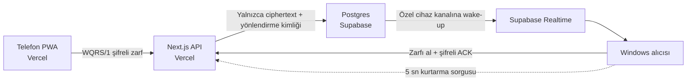

# Vercel + Supabase geçiş planı

Bu belge `codex/vercel-supabase` dalındaki kesintisiz geçişi anlatır. Çalışan
Sites/Cloudflare yayını, yeni sistem gerçek cihazla doğrulanana kadar açık
kalır. Kaynak dosyaların bu dalda değişmesi mevcut üretim dağıtımını kapatmaz.

## Hedef mimari

- Vercel, PWA'yı ve mevcut `/v1` HTTP sözleşmesini barındırır.
- Supabase Postgres yalnızca token özetleri, kısa ömürlü yönlendirme verileri ve
  uçtan uca şifreli zarfları tutar.
- Supabase Realtime birincil bildirim yoludur. Bildirim yalnızca rastgele
  `delivery_id` taşır; URL veya şifreli zarf Realtime mesajına konmaz.
- Masaüstü, Realtime bağlantısı yokken beş saniyede bir bekleyen teslimatı
  kontrol eder. Bağlantı sağlıklıyken yalnızca bildirim geldiğinde ve 60
  saniyelik güvenlik eşitlemesinde sorgu yapılır; polling ana taşıma yolu değildir.
- PC uygulaması dışarıya port açmaz; tüm bağlantılar dışarı doğrudur.

## Bu dalda tamamlanan uygulama dilimi

- PWA, `vinext` yerine standart `next dev`, `next build` ve `next start`
  komutlarıyla derleniyor.
- Vercel güvenlik başlıkları Next.js yapılandırmasına taşındı.
- Supabase Postgres şeması ve sürümlü migration eklendi.
- Relay tablolarında RLS açık; tarayıcı ve masaüstü tablolara doğrudan erişemez.
- Vercel API, Supabase'in yeni `sb_secret_...` anahtarını yalnızca `apikey`
  başlığında ve sunucu tarafında kullanıyor.
- Masaüstü, e-posta/telefon istemeyen anonim Supabase Auth oturumuyla yalnızca
  kendi özel Realtime cihaz kanalına bağlanıyor.
- Auth erişim ve yenileme token'ları Windows'ta mevcut DPAPI korumalı dosyanın
  içinde saklanıyor ve yenileme sırasında döndürülüyor.
- Eski localhost WebSocket relay'i ve mevcut Sites/D1 HTTP polling yolu geriye
  uyumlu kalıyor.
- Realtime kesilirse beş saniyelik kurtarma sorgusu teslimatı sürdürüyor.
- Masaüstü eşleşmiş telefonları güvenli özetlerle listeliyor ve erişimi önce
  relay'de iptal edip sonra yerel DPAPI kaydını siliyor. Ağ/5xx hatasında yerel
  kayıt korunuyor.
- İptal edilmiş telefon `pair_revoked` aldığında yalnız ilgili IndexedDB
  eşleşmesini siliyor ve yeniden eşleştirme yönlendirmesi gösteriyor.

Vercel hesap bağlantısı çözüldü. `codex/vercel-supabase` dalı için giriş
korumalı bir Preview dağıtımı hazır; GitHub PR #3 taslak durumdadır. Bu durum
yalnız dağıtımın tamamlandığını gösterir, gerçek cihaz akışının çalıştığını
kanıtlamaz. Kullanıcının tercihiyle Preview giriş koruması açık kalır.
Üretim dağıtımı, `main` dalı ve mevcut yayın değiştirilmedi.

## Giriş korumalı Preview testi

Vercel Authentication açık kalırken masaüstü HTTP istemcisi tarayıcı giriş
çerezini kullanamaz. Geçici test için Vercel projesinin **Settings → Deployment
Protection → Protection Bypass for Automation** bölümünde ayrı bir secret
oluşturulur. Secret, proje düzeyinde tüm dağıtımların korumasını bypass
edebildiğinden yalnız test süresince tutulur ve test bitince iptal edilir.
Değerini Git'e, sohbete, URL'ye veya Vercel PWA ortam değişkenlerine koymayın.

Masaüstü başlatılmadan önce aynı yerel PowerShell oturumunda
`WQRS_RELAY_ORIGIN` ile `WQRS_VERCEL_BYPASS_ORIGIN` **aynı tam HTTPS Preview
origin'ine**, `WQRS_VERCEL_BYPASS_SECRET` ise geçici değere ayarlanır. Başlık
yalnız bu origin'e gönderilir; Supabase'e, eski Sites origin'ine veya başka
Vercel dağıtımına iletilmez. Bu oturumdan başlatılan kaynak kodu/EXE ayarları
devralır; Explorer'dan çift tıklama aynı geçici ortamı devralmaz.

Telefonda önce **aynı Preview adresine** tarayıcıda giriş yapılır; ardından
PWA'nın kendi kamera tarayıcısıyla PC'deki eşleşme QR'ı okutulur. Normal telefon
kamerasından açılan link, giriş yönlendirmesinde QR'ın `#` parçasını
kaybedebilir. PWA API çağrıları yalnız aynı origin'in oturum çerezini taşır.
Preview test eşleşmesi kalıcı değildir: Production origin'ine geçildiğinde
cihazlar bir kez yeniden eşleştirilir.

## Gizlilik sınırı

Uygulama GPS/konum, mikrofon, kişi listesi, fotoğraf arşivi veya yerel ağ izni
istemez. QR kareleri cihazda çözülür ve yüklenmez. Açık URL Vercel veya
Supabase'e gönderilmez; yalnızca WQRS/1 ciphertext zarfı gider.

Supabase anonim oturumu bir kullanıcı hesabı ekranı oluşturmaz ve e-posta,
telefon veya profil istemez. Buna rağmen Vercel ve Supabase, kötüye kullanım ve
altyapı güvenliği için bağlantı IP'si gibi standart ağ metadatasını kendi
politikaları kapsamında işleyebilir. Uygulama, hız sınırı için ham IP yerine
sunucu sırrıyla özetlenmiş kısa ömürlü bir anahtar saklar. Uygulama loglarına
Authorization başlığı, token, URL, QR görüntüsü veya ciphertext gövdesi yazılmaz.

## Canlı geçiş sırası

1. Supabase projesi oluşturulur ve anonim giriş etkinleştirilir.
2. `supabase/migrations/202608030001_phone_to_pc_relay.sql` SQL Editor veya CLI
   ile uygulanır.
3. Realtime ayarında private channel kullanımı korunur; public kanal gerekmez.
4. GitHub deposu Vercel'e bağlanır ve Root Directory olarak `pwa` seçilir.
5. Önce Vercel Preview, doğrulamadan sonra Production ortamına şu değerler
   yalnız proje ayarlarından girilir:
   `SUPABASE_URL`, `SUPABASE_PUBLISHABLE_KEY`, `SUPABASE_SECRET_KEY` ve en az
   32 karakterlik rastgele `RELAY_RATE_LIMIT_PEPPER`.
6. Önizleme dağıtımında `/healthz`, PWA kamera yaşam döngüsü, eşleştirme,
   Realtime teslimi, ACK, replay reddi ve beş saniyelik kurtarma yolu sınanır.
7. Sabit Production `.vercel.app` adresi seçilir. Preview URL yalnız geçici
   doğrulama eşleşmesi içindir; kalıcı kullanıcı eşleşmesinde kullanılmaz.
8. Masaüstünün varsayılan public relay adresi bu sabit URL'ye alınır ve yeni EXE
   üretilir. Origin değiştiği için telefon bir kez yeniden eşleştirilir.
9. En az 48 saat iki sistem paralel tutulur. Yeni sistemin gerçek iPhone ve
   Android testleri geçince Sites/Cloudflare yayını kaldırılır ve eski D1
   kaynakları yalnız ayrı açık onayla silinir.

Dağıtım ve gerçek cihaz sonuçları
[`v0.2-beta-release-checklist.tr.md`](v0.2-beta-release-checklist.tr.md)
üzerinde kanıtlanır. Bir testin yerel olarak geçmesi, ilgili gerçek cihaz veya
production maddesini tamamlanmış saymaz.

## Gerekli sırlar

Gerçek değerler Git'e, README'ye, masaüstü EXE'ye veya PWA JavaScript paketine
konmaz. `SUPABASE_SECRET_KEY` yalnızca Vercel sunucu ortamında bulunur.
`SUPABASE_PUBLISHABLE_KEY` tasarımı gereği halka açıktır; veri erişimini RLS ve
anonim kullanıcı oturumu sınırlar. Yerel geliştirme için `.env.example`
`.env.local` adıyla kopyalanır; `.env.local` Git tarafından yok sayılır.

## Geri dönüş

Canlı test başarısız olursa masaüstünün varsayılan relay adresi eski Sites
origin'inde bırakılır. Bu geçiş dalı `main` ile birleştirilmediği ve eski dağıtım
kaldırılmadığı sürece kullanıcı akışı etkilenmez. Supabase tablolarını silmek
veya Sites yayınını kapatmak, yalnızca yeni Production testi tamamlandıktan
sonra yapılır.
